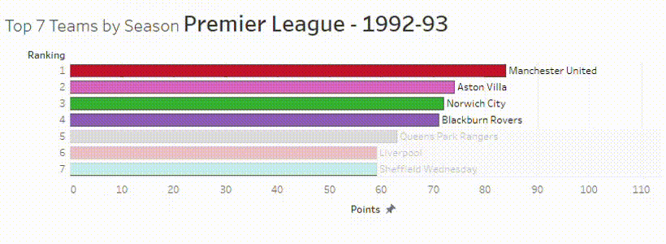

# Premier League - Bar Chart Race

Bar chart races project realized with Python and Tableau.

-- Project status: [Completed]

## About



## Repository overview

```
├── README.md
├── notebook
├── data
└── files
```

- Premier League

premier league football standings between 1992 and 2017. Visualization realized with bar_chart_race

[Data](https://www.kaggle.com/lynuhs/premier-league-19922017/version/1?select=premierLeague_tables_1992-2017.csv)