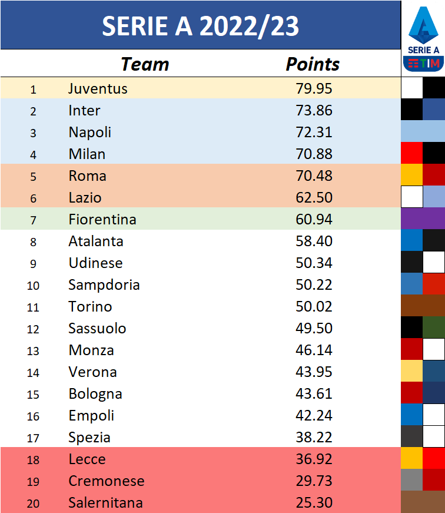

# Serie A 2022/23

1. League Standing

2. Random with Personal View

Atalanta's home games:
==================================================
Atalanta 0 : 0 Lecce
Atalanta 0 : 0 Monza
Atalanta 0 : 0 Bologna
Atalanta 1 : 1 Hellas Verona
Atalanta 2 : 0 Cremonese
Atalanta 0 : 1 Fiorentina
Atalanta 1 : 0 Empoli
Atalanta 0 : 1 Inter
Atalanta 1 : 0 Juventus
Atalanta 1 : 1 Lazio
Atalanta 1 : 2 Milan
Atalanta 3 : 0 Spezia
Atalanta 1 : 2 Napoli
Atalanta 2 : 1 Sassuolo
Atalanta 0 : 1 Roma
Atalanta 7 : 2 Salernitana
Atalanta 1 : 1 Sampdoria
Atalanta 2 : 0 Torino
Atalanta 6 : 2 Udinese
==================================================
Lecce's home games:
==================================================
Lecce 1 : 5 Atalanta
Lecce 1 : 5 Monza
Lecce 0 : 1 Bologna
Lecce 2 : 1 Hellas Verona
Lecce 1 : 2 Cremonese
Lecce 0 : 0 Fiorentina
Lecce 1 : 0 Empoli
Lecce 1 : 3 Inter
Lecce 1 : 1 Juventus
Lecce 0 : 3 Lazio
Lecce 0 : 0 Milan
Lecce 0 : 0 Spezia
Lecce 0 : 2 Napoli
Lecce 0 : 2 Sassuolo
Lecce 0 : 1 Roma
Lecce 1 : 2 Salernitana
Lecce 0 : 0 Sampdoria
Lecce 0 : 2 Torino
Lecce 2 : 0 Udinese
==================================================
Monza's home games:
==================================================
Monza 0 : 3 Atalanta
Monza 1 : 1 Lecce
Monza 1 : 0 Bologna
Monza 0 : 1 Hellas Verona
Monza 1 : 0 Cremonese
Monza 0 : 3 Fiorentina
Monza 1 : 1 Empoli
Monza 1 : 2 Inter
Monza 0 : 2 Juventus
Monza 0 : 0 Lazio
Monza 0 : 2 Milan
Monza 2 : 0 Spezia
Monza 0 : 3 Napoli
Monza 2 : 1 Sassuolo
Monza 1 : 1 Roma
Monza 1 : 1 Salernitana
Monza 0 : 1 Sampdoria
Monza 1 : 0 Torino
Monza 0 : 0 Udinese
==================================================
Bologna's home games:
==================================================
Bologna 0 : 2 Atalanta
Bologna 0 : 0 Lecce
Bologna 2 : 1 Monza
Bologna 1 : 0 Hellas Verona
Bologna 2 : 4 Cremonese
Bologna 0 : 0 Fiorentina
Bologna 1 : 1 Empoli
Bologna 2 : 3 Inter
Bologna 3 : 4 Juventus
Bologna 3 : 1 Lazio
Bologna 0 : 3 Milan
Bologna 1 : 0 Spezia
Bologna 1 : 0 Napoli
Bologna 1 : 1 Sassuolo
Bologna 0 : 3 Roma
Bologna 0 : 0 Salernitana
Bologna 1 : 0 Sampdoria
Bologna 0 : 2 Torino
Bologna 0 : 0 Udinese
==================================================
Hellas Verona's home games:
==================================================
Hellas Verona 1 : 1 Atalanta
Hellas Verona 1 : 1 Lecce
Hellas Verona 2 : 0 Monza
Hellas Verona 0 : 0 Bologna
Hellas Verona 2 : 2 Cremonese
Hellas Verona 0 : 1 Fiorentina
Hellas Verona 1 : 1 Empoli
Hellas Verona 3 : 1 Inter
Hellas Verona 2 : 1 Juventus
Hellas Verona 3 : 1 Lazio
Hellas Verona 0 : 2 Milan
Hellas Verona 1 : 0 Spezia
Hellas Verona 0 : 1 Napoli
Hellas Verona 0 : 1 Sassuolo
Hellas Verona 1 : 3 Roma
Hellas Verona 0 : 1 Salernitana
Hellas Verona 0 : 3 Sampdoria
Hellas Verona 0 : 2 Torino
Hellas Verona 0 : 1 Udinese
==================================================
Cremonese's home games:
==================================================
Cremonese 1 : 2 Atalanta
Cremonese 1 : 0 Lecce
Cremonese 1 : 2 Monza
Cremonese 0 : 2 Bologna
Cremonese 1 : 1 Hellas Verona
Cremonese 1 : 1 Fiorentina
Cremonese 0 : 2 Empoli
Cremonese 0 : 2 Inter
Cremonese 1 : 2 Juventus
Cremonese 0 : 1 Lazio
Cremonese 0 : 4 Milan
Cremonese 0 : 1 Spezia
Cremonese 1 : 4 Napoli
Cremonese 1 : 2 Sassuolo
Cremonese 0 : 4 Roma
Cremonese 0 : 1 Salernitana
Cremonese 1 : 1 Sampdoria
Cremonese 1 : 0 Torino
Cremonese 1 : 0 Udinese
==================================================
Fiorentina's home games:
==================================================
Fiorentina 1 : 0 Atalanta
Fiorentina 4 : 1 Lecce
Fiorentina 3 : 0 Monza
Fiorentina 2 : 1 Bologna
Fiorentina 0 : 1 Hellas Verona
Fiorentina 1 : 0 Cremonese
Fiorentina 1 : 1 Empoli
Fiorentina 1 : 2 Inter
Fiorentina 0 : 2 Juventus
Fiorentina 0 : 2 Lazio
Fiorentina 0 : 2 Milan
Fiorentina 1 : 0 Spezia
Fiorentina 1 : 2 Napoli
Fiorentina 0 : 4 Sassuolo
Fiorentina 0 : 0 Roma
Fiorentina 2 : 0 Salernitana
Fiorentina 1 : 1 Sampdoria
Fiorentina 0 : 0 Torino
Fiorentina 0 : 1 Udinese
==================================================
Empoli's home games:
==================================================
Empoli 0 : 2 Atalanta
Empoli 1 : 1 Lecce
Empoli 0 : 0 Monza
Empoli 0 : 1 Bologna
Empoli 2 : 1 Hellas Verona
Empoli 1 : 0 Cremonese
Empoli 1 : 2 Fiorentina
Empoli 1 : 4 Inter
Empoli 1 : 1 Juventus
Empoli 2 : 1 Lazio
Empoli 1 : 1 Milan
Empoli 1 : 1 Spezia
Empoli 2 : 2 Napoli
Empoli 0 : 1 Sassuolo
Empoli 0 : 2 Roma
Empoli 3 : 1 Salernitana
Empoli 0 : 0 Sampdoria
Empoli 0 : 0 Torino
Empoli 0 : 3 Udinese
==================================================
Inter's home games:
==================================================
Inter 1 : 0 Atalanta
Inter 2 : 0 Lecce
Inter 1 : 2 Monza
Inter 1 : 0 Bologna
Inter 1 : 0 Hellas Verona
Inter 8 : 0 Cremonese
Inter 2 : 2 Fiorentina
Inter 2 : 1 Empoli
Inter 2 : 1 Juventus
Inter 1 : 1 Lazio
Inter 1 : 1 Milan
Inter 0 : 0 Spezia
Inter 1 : 2 Napoli
Inter 0 : 0 Sassuolo
Inter 0 : 0 Roma
Inter 5 : 0 Salernitana
Inter 3 : 0 Sampdoria
Inter 0 : 1 Torino
Inter 0 : 0 Udinese
==================================================
Juventus's home games:
==================================================
Juventus 0 : 1 Atalanta
Juventus 1 : 1 Lecce
Juventus 3 : 1 Monza
Juventus 2 : 1 Bologna
Juventus 3 : 0 Hellas Verona
Juventus 0 : 1 Cremonese
Juventus 2 : 1 Fiorentina
Juventus 3 : 0 Empoli
Juventus 1 : 1 Inter
Juventus 0 : 0 Lazio
Juventus 2 : 0 Milan
Juventus 0 : 0 Spezia
Juventus 1 : 1 Napoli
Juventus 2 : 1 Sassuolo
Juventus 1 : 0 Roma
Juventus 2 : 1 Salernitana
Juventus 0 : 0 Sampdoria
Juventus 2 : 0 Torino
Juventus 0 : 0 Udinese
==================================================
Lazio's home games:
==================================================
Lazio 0 : 0 Atalanta
Lazio 1 : 0 Lecce
Lazio 1 : 0 Monza
Lazio 3 : 1 Bologna
Lazio 2 : 0 Hellas Verona
Lazio 0 : 1 Cremonese
Lazio 5 : 1 Fiorentina
Lazio 2 : 0 Empoli
Lazio 1 : 1 Inter
Lazio 0 : 3 Juventus
Lazio 1 : 2 Milan
Lazio 0 : 0 Spezia
Lazio 0 : 1 Napoli
Lazio 1 : 0 Sassuolo
Lazio 0 : 0 Roma
Lazio 0 : 0 Salernitana
Lazio 3 : 1 Sampdoria
Lazio 2 : 1 Torino
Lazio 4 : 0 Udinese
==================================================
Milan's home games:
==================================================
Milan 2 : 0 Atalanta
Milan 5 : 0 Lecce
Milan 2 : 0 Monza
Milan 0 : 1 Bologna
Milan 0 : 2 Hellas Verona
Milan 2 : 0 Cremonese
Milan 0 : 1 Fiorentina
Milan 3 : 1 Empoli
Milan 0 : 0 Inter
Milan 0 : 0 Juventus
Milan 0 : 0 Lazio
Milan 1 : 1 Spezia
Milan 1 : 0 Napoli
Milan 2 : 1 Sassuolo
Milan 0 : 0 Roma
Milan 3 : 0 Salernitana
Milan 2 : 1 Sampdoria
Milan 0 : 0 Torino
Milan 5 : 0 Udinese
==================================================
Spezia's home games:
==================================================
Spezia 2 : 2 Atalanta
Spezia 0 : 1 Lecce
Spezia 0 : 1 Monza
Spezia 0 : 0 Bologna
Spezia 0 : 5 Hellas Verona
Spezia 1 : 2 Cremonese
Spezia 0 : 1 Fiorentina
Spezia 0 : 0 Empoli
Spezia 1 : 4 Inter
Spezia 1 : 0 Juventus
Spezia 1 : 1 Lazio
Spezia 0 : 2 Milan
Spezia 0 : 0 Napoli
Spezia 0 : 1 Sassuolo
Spezia 2 : 2 Roma
Spezia 2 : 1 Salernitana
Spezia 1 : 1 Sampdoria
Spezia 1 : 2 Torino
Spezia 2 : 2 Udinese
==================================================
Napoli's home games:
==================================================
Napoli 1 : 1 Atalanta
Napoli 3 : 0 Lecce
Napoli 1 : 0 Monza
Napoli 2 : 0 Bologna
Napoli 1 : 0 Hellas Verona
Napoli 1 : 0 Cremonese
Napoli 1 : 2 Fiorentina
Napoli 1 : 1 Empoli
Napoli 0 : 1 Inter
Napoli 1 : 2 Juventus
Napoli 0 : 1 Lazio
Napoli 1 : 1 Milan
Napoli 1 : 0 Spezia
Napoli 2 : 0 Sassuolo
Napoli 0 : 1 Roma
Napoli 4 : 2 Salernitana
Napoli 1 : 0 Sampdoria
Napoli 2 : 0 Torino
Napoli 2 : 1 Udinese
==================================================
Sassuolo's home games:
==================================================
Sassuolo 1 : 0 Atalanta
Sassuolo 2 : 0 Lecce
Sassuolo 0 : 1 Monza
Sassuolo 2 : 0 Bologna
Sassuolo 0 : 1 Hellas Verona
Sassuolo 2 : 1 Cremonese
Sassuolo 0 : 2 Fiorentina
Sassuolo 3 : 0 Empoli
Sassuolo 0 : 3 Inter
Sassuolo 1 : 1 Juventus
Sassuolo 3 : 1 Lazio
Sassuolo 0 : 0 Milan
Sassuolo 1 : 0 Spezia
Sassuolo 0 : 0 Napoli
Sassuolo 0 : 0 Roma
Sassuolo 1 : 0 Salernitana
Sassuolo 3 : 0 Sampdoria
Sassuolo 1 : 0 Torino
Sassuolo 1 : 0 Udinese
==================================================
Roma's home games:
==================================================
Roma 1 : 3 Atalanta
Roma 0 : 0 Lecce
Roma 1 : 1 Monza
Roma 2 : 1 Bologna
Roma 1 : 0 Hellas Verona
Roma 1 : 1 Cremonese
Roma 0 : 0 Fiorentina
Roma 2 : 0 Empoli
Roma 0 : 0 Inter
Roma 1 : 1 Juventus
Roma 0 : 1 Lazio
Roma 1 : 1 Milan
Roma 1 : 1 Spezia
Roma 1 : 1 Napoli
Roma 0 : 0 Sassuolo
Roma 5 : 0 Salernitana
Roma 0 : 1 Sampdoria
Roma 1 : 0 Torino
Roma 0 : 3 Udinese
==================================================
Salernitana's home games:
==================================================
Salernitana 2 : 1 Atalanta
Salernitana 1 : 0 Lecce
Salernitana 1 : 1 Monza
Salernitana 0 : 2 Bologna
Salernitana 0 : 2 Hellas Verona
Salernitana 1 : 1 Cremonese
Salernitana 0 : 1 Fiorentina
Salernitana 1 : 3 Empoli
Salernitana 0 : 3 Inter
Salernitana 2 : 1 Juventus
Salernitana 2 : 5 Lazio
Salernitana 1 : 3 Milan
Salernitana 0 : 1 Spezia
Salernitana 1 : 4 Napoli
Salernitana 2 : 1 Sassuolo
Salernitana 0 : 4 Roma
Salernitana 1 : 1 Sampdoria
Salernitana 1 : 1 Torino
Salernitana 0 : 1 Udinese
==================================================
Sampdoria's home games:
==================================================
Sampdoria 0 : 1 Atalanta
Sampdoria 2 : 0 Lecce
Sampdoria 1 : 0 Monza
Sampdoria 2 : 0 Bologna
Sampdoria 1 : 0 Hellas Verona
Sampdoria 1 : 1 Cremonese
Sampdoria 1 : 0 Fiorentina
Sampdoria 1 : 0 Empoli
Sampdoria 1 : 2 Inter
Sampdoria 0 : 6 Juventus
Sampdoria 1 : 1 Lazio
Sampdoria 1 : 0 Milan
Sampdoria 2 : 3 Spezia
Sampdoria 2 : 2 Napoli
Sampdoria 1 : 2 Sassuolo
Sampdoria 2 : 3 Roma
Sampdoria 2 : 0 Salernitana
Sampdoria 1 : 1 Torino
Sampdoria 1 : 1 Udinese
==================================================
Torino's home games:
==================================================
Torino 2 : 2 Atalanta
Torino 1 : 1 Lecce
Torino 0 : 1 Monza
Torino 3 : 0 Bologna
Torino 3 : 1 Hellas Verona
Torino 1 : 1 Cremonese
Torino 2 : 3 Fiorentina
Torino 2 : 2 Empoli
Torino 0 : 2 Inter
Torino 0 : 0 Juventus
Torino 0 : 0 Lazio
Torino 4 : 0 Milan
Torino 2 : 0 Spezia
Torino 0 : 0 Napoli
Torino 1 : 0 Sassuolo
Torino 0 : 0 Roma
Torino 2 : 0 Salernitana
Torino 3 : 4 Sampdoria
Torino 0 : 1 Udinese
==================================================
Udinese's home games:
==================================================
Udinese 1 : 2 Atalanta
Udinese 2 : 0 Lecce
Udinese 1 : 0 Monza
Udinese 1 : 0 Bologna
Udinese 0 : 2 Hellas Verona
Udinese 2 : 0 Cremonese
Udinese 0 : 2 Fiorentina
Udinese 2 : 1 Empoli
Udinese 0 : 0 Inter
Udinese 1 : 2 Juventus
Udinese 0 : 1 Lazio
Udinese 0 : 0 Milan
Udinese 1 : 2 Spezia
Udinese 2 : 2 Napoli
Udinese 0 : 2 Sassuolo
Udinese 0 : 0 Roma
Udinese 2 : 0 Salernitana
Udinese 3 : 1 Sampdoria
Udinese 0 : 1 Torino
============================================================================================================
| CLUB                      |  MP  |  W  |  D  |  L  |  GF  |  GA  |  GD  |  PTS   |
| Inter                     |  38  | 22  | 12  |  4  |  66  |  24  |  42  |   78   |
| Napoli                    |  38  | 20  | 11  |  7  |  54  |  28  |  26  |   71   |
| Milan                     |  38  | 19  | 13  |  6  |  54  |  22  |  32  |   70   |
| Juventus                  |  38  | 18  | 13  |  7  |  55  |  28  |  27  |   67   |
| Lazio                     |  38  | 17  | 13  |  8  |  48  |  29  |  19  |   64   |
| Sassuolo                  |  38  | 19  |  7  | 12  |  42  |  27  |  15  |   64   |
| Fiorentina                |  38  | 18  |  9  | 11  |  42  |  35  |  7   |   63   |
| Atalanta                  |  38  | 17  | 11  | 10  |  57  |  32  |  25  |   62   |
| Roma                      |  38  | 14  | 19  |  5  |  43  |  22  |  21  |   61   |
| Sampdoria                 |  38  | 12  | 13  | 13  |  40  |  47  |  -7  |   49   |
| Torino                    |  38  | 12  | 13  | 13  |  39  |  33  |  6   |   49   |
| Udinese                   |  38  | 13  | 10  | 15  |  34  |  42  |  -8  |   49   |
| Monza                     |  38  | 11  | 10  | 17  |  28  |  43  | -15  |   43   |
| Hellas Verona             |  38  | 12  |  7  | 19  |  36  |  42  |  -6  |   43   |
| Bologna                   |  38  | 11  |  9  | 18  |  29  |  46  | -17  |   42   |
| Empoli                    |  38  |  6  | 15  | 17  |  31  |  52  | -21  |   33   |
| Spezia                    |  38  |  6  | 15  | 17  |  24  |  46  | -22  |   33   |
| Cremonese                 |  38  |  8  |  8  | 22  |  28  |  62  | -34  |   32   |
| Salernitana               |  38  |  7  |  7  | 24  |  28  |  78  | -50  |   28   |
| Lecce                     |  38  |  4  | 13  | 21  |  18  |  58  | -40  |   25   |