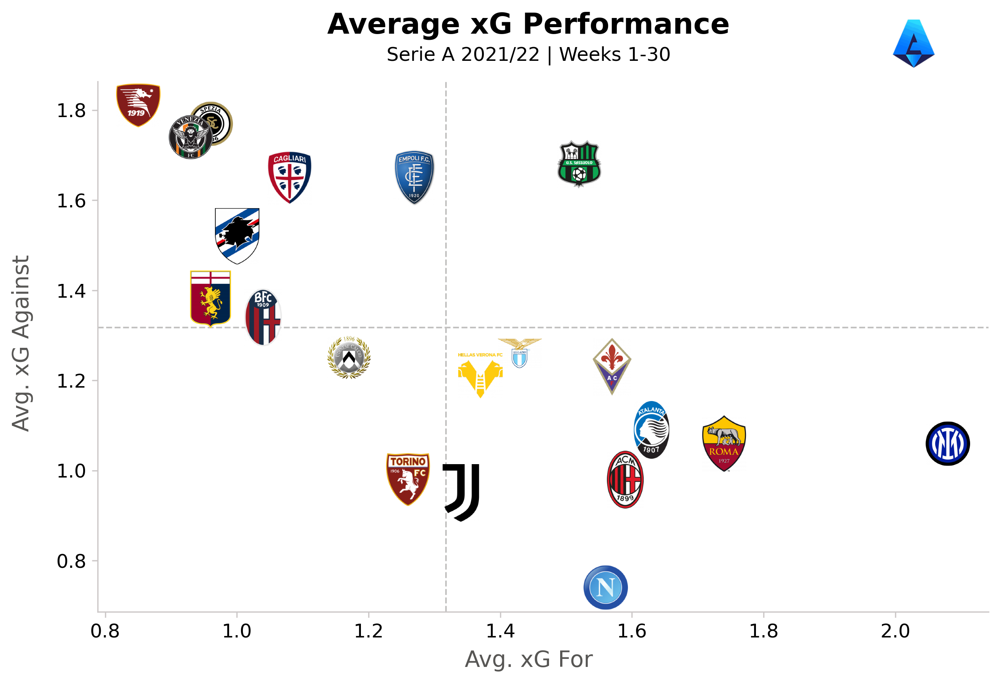
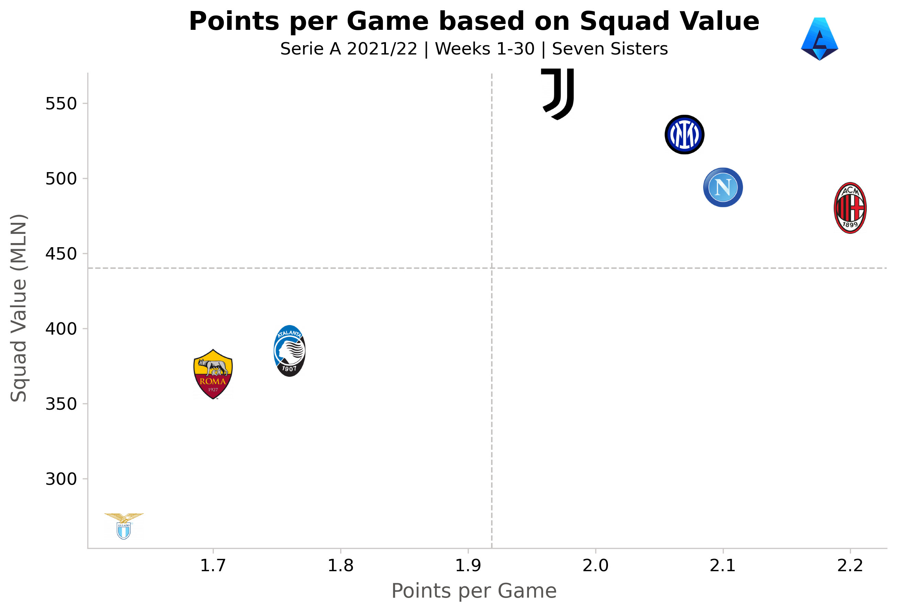
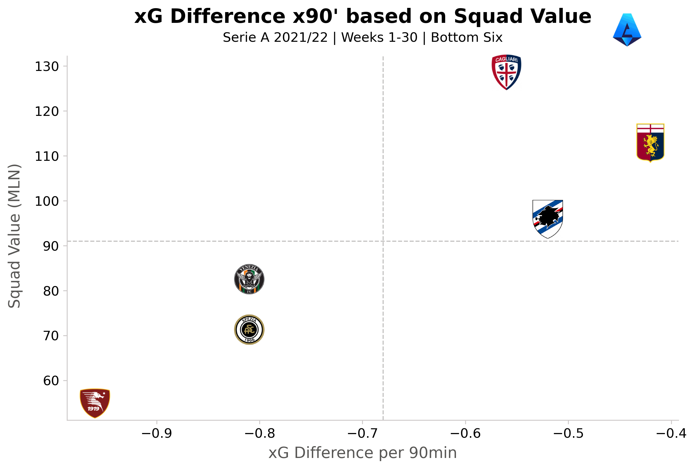

# Serie A

An analysis of the current state of the Italian football championship.

### About

With eight fixtures to go and thirty already played, which team has the best stats and the best chances to achieve their aim?

The data are scraped from _fbref_ with `requests` and `beautifulSoup` and contain general information about the league as well as xG data.